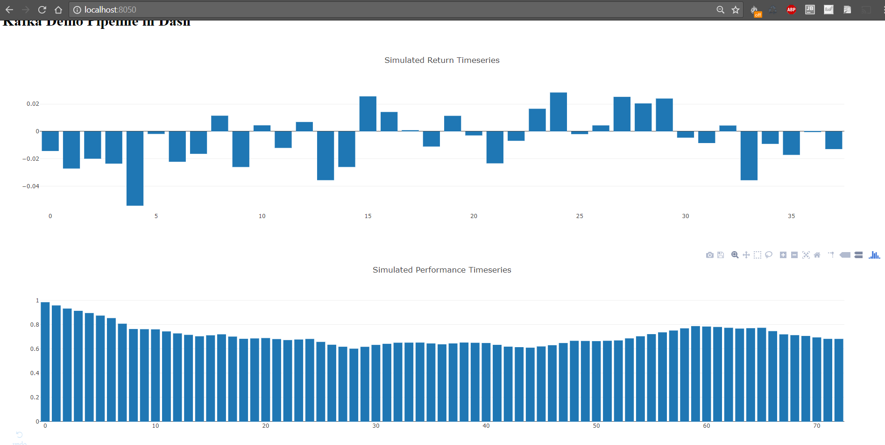

To run the demo you need to open up two terminal windows. 
* Go to the first one and run  
  `java -jar /build/libs/demo-1.0-SNAPSHOT.jar`
* After the emedded kafka has been stared, go to the second one and run  
  `python src/main/python3/demo-dash.py`

Then navigate your browser to [http://localhost:8050/](http://localhost:8050/). 
You should see a continously updating graph like this.

What happens here is that we generate some random numbers into a kafka topic. 
There is one piplet which reads from that topic and creates a cumulative timeseries.
We simply read both topics and plot them.  
